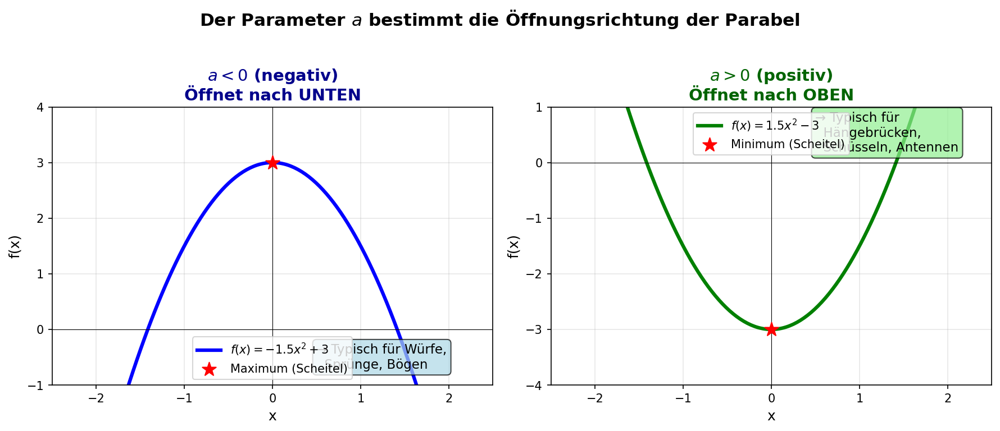
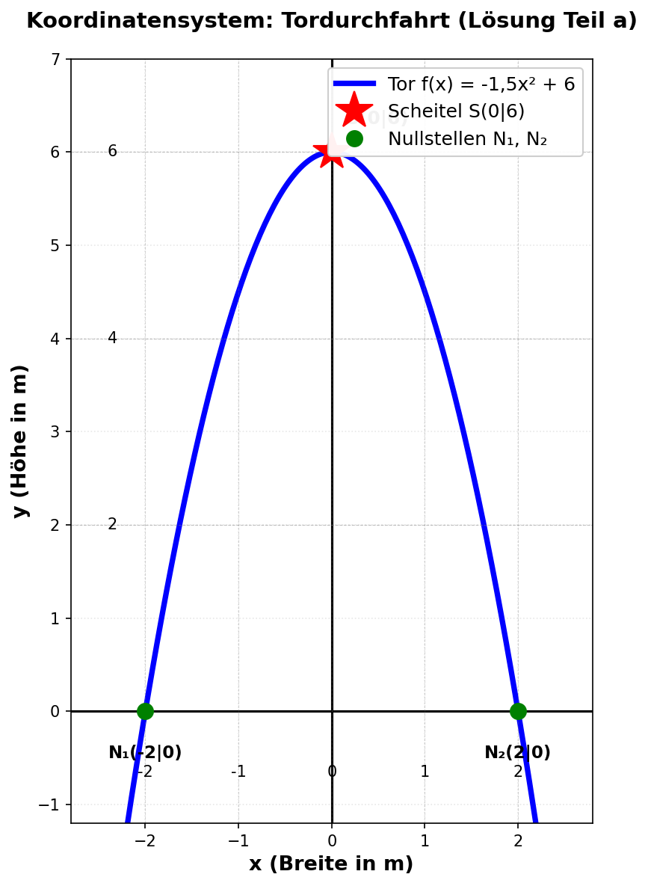
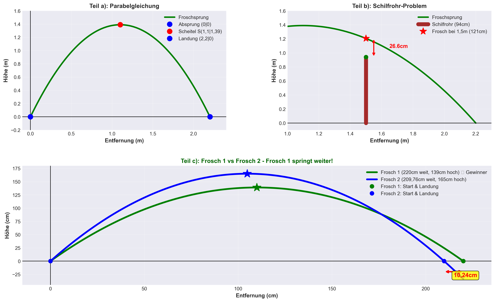
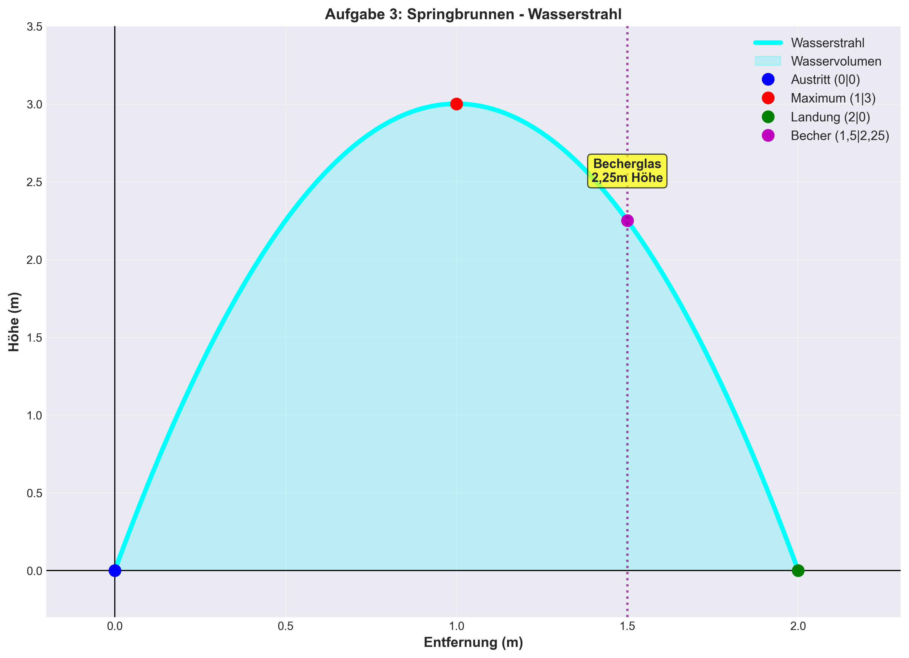
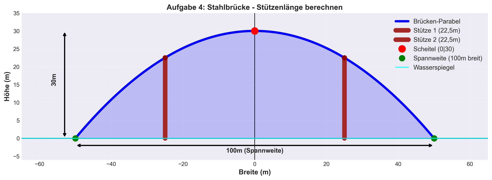
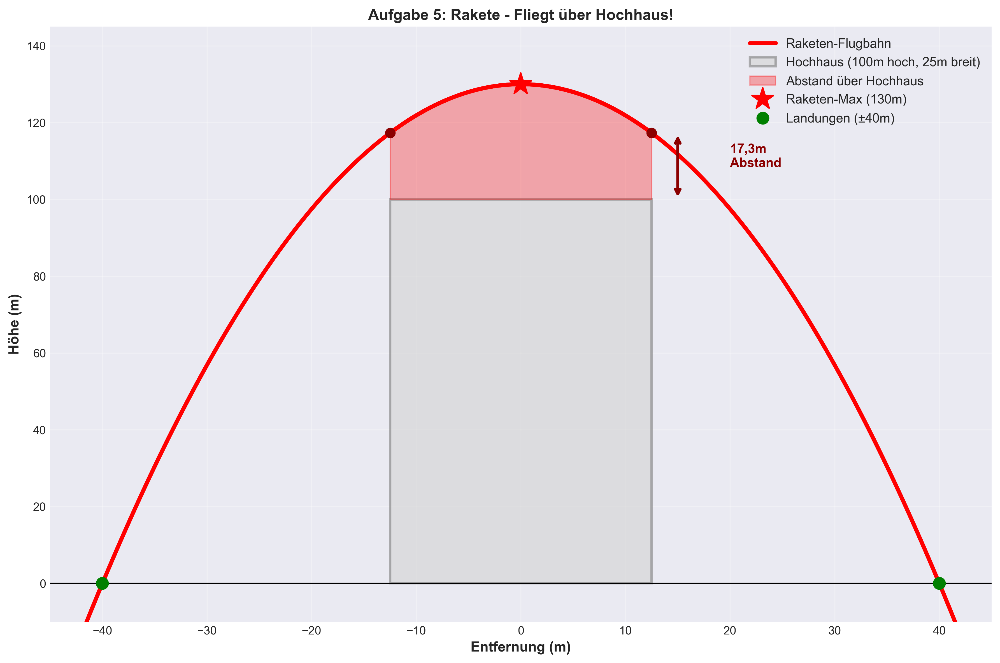

# 📐 Parabeln – Lernheft Klasse 10

> **Lernziel:** Du kannst quadratische Funktionen in realen Situationen aufstellen, auswerten und interpretieren.

## 📋 Inhaltsverzeichnis

1. [🗺️ Wie du dieses Lernheft benutzt](#-wie-du-dieses-lernheft-benutzt)
2. [1️⃣ Grundlagen – Was du wissen musst](#️1️⃣-grundlagen--was-du-wissen-musst)
3. [2️⃣ Methode – So gehst du vor](#️2️⃣-methode--so-gehst-du-vor)
4. [3️⃣ Geführtes Beispiel – Tordurchfahrt](#️3️⃣-geführtes-beispiel--tordurchfahrt)
5. [4️⃣ Prüfungsaufgabe – Der Froschsprung](#️4️⃣-prüfungsaufgabe--der-froschsprung)
6. [5️⃣ Alle Aufgaben](#️5️⃣-alle-aufgaben)
7. [6️⃣ Lerntipps – wissenschaftlich belegt](#️6️⃣-lerntipps--wissenschaftlich-belegt)
8. [7️⃣ Die 5 häufigsten Fehler](#️7️⃣-die-5-häufigsten-fehler)
9. [8️⃣ Selbsttest – Checkliste](#️8️⃣-selbsttest--checkliste)
10. [9️⃣ Interaktiv üben mit GeoGebra](#️9️⃣-interaktiv-üben-mit-geogebra)
11. [📂 Übersicht der Visualisierungen](#-übersicht-der-visualisierungen)

---

## 🗺️ Wie du dieses Lernheft benutzt

```
① Grundlagen lesen       → Was brauche ich?       (ca. 15 min)
② Geführtes Beispiel     → Wie geht es?            (ca. 20 min)
③ Aufgaben selbst lösen  → Kann ich es?            (aufgaben.md)
④ Lösung vergleichen     → Was habe ich gelernt?   (loesungen.md)
⑤ Checkliste abhaken     → Bin ich fertig?         (Ende dieser Seite)
```

> 💡 **Tipp:** Arbeite die Schritte **der Reihe nach** ab. Schau nicht in die Lösung, bevor du wirklich versucht hast, die Aufgabe selbst zu lösen!

---

## 1️⃣ Grundlagen – Was du wissen musst

### Was ist eine Parabel?

Eine **Parabel** ist der Graph einer **quadratischen Funktion**. Sie erscheint überall in der Natur und Technik, weil Objekte, die sich durch die Luft bewegen, immer einer Parabel folgen.

**Beispiele aus dem Alltag:**

| 🌍 Situation | Gleichung | Frage |
|---|---|---|
| Frosch springt über ein Schilfrohr | $f(x) = -1{,}149(x-1{,}1)^2 + 1{,}39$ | Kommt er drüber? |
| Auto fährt durch ein Torgewölbe | $f(x) = -1{,}5x^2 + 6$ | Passt es durch? |
| Kugel fliegt beim Kugelstoßen | $f(x) = -0{,}24(x-4)^2 + 5{,}84$ | Wie weit fliegt sie? |
| Wasser im Springbrunnen | $f(x) = -3(x-1)^2 + 3$ | Auf welcher Höhe kommt es an? |

---

### Die drei Darstellungsformen

Es gibt drei verschiedene Wege, eine Parabel aufzuschreiben. Jede Form hat Vorteile:

| Form | Gleichung | Direkt ablesbar | Wann nutzen? |
|---|---|---|---|
| **Scheitelpunktform** ⭐ | $f(x) = a(x-d)^2 + c$ | Scheitelpunkt $S(d \mid c)$ | Wenn max./min. Punkt bekannt |
| **Allgemeine Form** | $f(x) = ax^2 + bx + c$ | y-Achsenabschnitt $c$ | Wenn Ausgangspunkt bei $x=0$ |
| **Nullstellenform** | $f(x) = a(x-x_1)(x-x_2)$ | Nullstellen $x_1$, $x_2$ | Wenn Auftreff/Abflugpunkt bekannt |

> **⭐ Für Anwendungsaufgaben ist die Scheitelpunktform fast immer die beste Wahl**, weil der Scheitelpunkt meist der höchste (oder tiefste) Punkt eines Sprungs, Bogens oder Wurfs ist.

---

### Der Parameter $a$ – die wichtigste Zahl

$$f(x) = a(x-d)^2 + c$$

Der Wert von $a$ bestimmt **alles Wichtige** an der Form der Parabel:



**Betrag von $a$ bestimmt die Breite:**
- $|a|$ groß (z.B. 3) → Parabel schmal und steil
- $|a|$ klein (z.B. 0,1) → Parabel breit und flach

---

### Der Scheitelpunkt – das Herzstück

Der **Scheitelpunkt** $S(d \mid c)$ ist der höchste oder tiefste Punkt der Parabel.

**Goldene Regel:** Bei einer Parabel mit zwei Nullstellen liegt der Scheitelpunkt immer **genau in der Mitte** zwischen ihnen:

$$d = \frac{x_1 + x_2}{2}$$

**Beispiel:** Frosch springt von $x = 0$ bis $x = 2{,}20$ m → Scheitelpunkt bei $x = \frac{0 + 2{,}20}{2} = 1{,}10$ m ✓

---

## 2️⃣ Methode – So gehst du vor

### Das 4-Schritte-Schema (immer gleich!)

| Schritt | Aktion | Details |
|---|---|---|
| **1️⃣ Koordinatensystem** | **Einrichten** | Wo ist $x = 0$? Wo liegt der Scheitelpunkt? Welche Punkte kennst du? (Scheitel, Nullstellen, ...) |
| **2️⃣ Form wählen** | **Einsetzen** | Scheitelpunktform: $f(x) = a(x - d)^2 + c$ mit bekanntem Scheitel $S(d \mid c)$ |
| **3️⃣ Parameter** | **Berechnen** | Weiteren bekannten Punkt $(x \mid y)$ in die Form einsetzen → nach $a$ auflösen |
| **4️⃣ Antwort** | **Prüfen** | Gesuchten Wert berechnen → Probe mit bekanntem Punkt durchführen |

---

## 3️⃣ Geführtes Beispiel – Tordurchfahrt

*Lies jeden Schritt, dann versuche den nächsten selbst, bevor du weiterliest.*

### Aufgabe

> Ein Tor hat die Form einer Parabel. Es ist **6 m hoch** und **4 m breit**.
> **a)** Stelle die Funktionsgleichung auf.
> **b)** Kann ein Fahrzeug (3 m breit, 2,20 m hoch) hindurchfahren?

---

### Lösung a) – Schritt 1: Koordinatensystem einrichten

Wir legen den Nullpunkt **in die Mitte** des Tores am Boden. Dann gilt:



Abgelesene Punkte:
- **Scheitelpunkt:** $S(0 \mid 6)$ → d = 0, c = 6
- **Nullstellen:** $N_1(-2 \mid 0)$ und $N_2(2 \mid 0)$ (halbierte Breite = 4 m / 2 = 2 m)

---

### Lösung a) – Schritt 2 & 3: Gleichung aufstellen, $a$ berechnen

$$f(x) = a(x - 0)^2 + 6 = ax^2 + 6$$

Punkt $N_2(2 \mid 0)$ einsetzen:

$$0 = a \cdot 2^2 + 6 \quad \Rightarrow \quad 0 = 4a + 6 \quad \Rightarrow \quad a = -1{,}5$$

$$\boxed{f(x) = -1{,}5x^2 + 6}$$

**Probe:** $f(-2) = -1{,}5 \cdot 4 + 6 = 0$ ✓

---

### Lösung b) – Schritt 4: Frage beantworten

Das Fahrzeug ist 3 m breit → reicht von $x = -1{,}5$ bis $x = +1{,}5$ (mittig geparkt).

Torthöhe an der schmalsten Stelle, bei $x = 1{,}5$:

$$f(1{,}5) = -1{,}5 \cdot (1{,}5)^2 + 6 = -1{,}5 \cdot 2{,}25 + 6 = -3{,}375 + 6 = 2{,}625 \text{ m}$$

| | Maß |
|---|---|
| Tor-Innenhöhe bei $x = 1{,}5$ | **2,625 m** |
| Fahrzeughöhe | 2,200 m |
| Freier Platz | **0,425 m = 42,5 cm** ✅ |

**Antwort:** Ja, das Fahrzeug passt mit **42,5 cm Luft** durch.


---

## 4️⃣ Prüfungsaufgabe – Der Froschsprung

*Versuche zuerst, die Aufgabe alleine zu lösen. Erst dann die Lösung lesen!*

### Aufgabe (Prüfung Bayern 2023)

> Ein Frosch springt parabelförmig. Sprungweite: **220 cm**. Maximale Höhe: **139 cm**.
>
> **a)** Stelle die Parabelgleichung auf.
> **b)** Ein Schilfrohr steht bei 150 cm Entfernung und ragt 94 cm aus dem Wasser. Mit welchem Abstand springt der Frosch darüber?
> **c)** Frosch 2 springt nach $y = -\dfrac{3}{200}x^2 + 165$ (x, y in cm). Welcher Frosch springt weiter? Berechne die Differenz.

---

### Lösung a)

**Schritt 1:** Absprung bei $(0 \mid 0)$, Landung bei $(220 \mid 0)$, also:

$$d = \frac{0 + 220}{2} = 110 \text{ cm}, \quad c = 139 \quad \Rightarrow \quad S(110 \mid 139)$$

**Schritt 2:** Scheitelpunktform einsetzen und $a$ berechnen:

$$f(x) = a(x - 110)^2 + 139$$

Punkt $(0 \mid 0)$ einsetzen:

$$0 = a(0 - 110)^2 + 139 = 12100a + 139 \quad \Rightarrow \quad a = -\frac{139}{12100} \approx -0{,}01149$$

$$\boxed{f(x) = -0{,}01149(x - 110)^2 + 139}$$

---

### Lösung b)

Froschhöhe bei $x = 150$ cm:

$$f(150) = -0{,}01149 \cdot (150 - 110)^2 + 139 = -0{,}01149 \cdot 1600 + 139 = -18{,}384 + 139 \approx 120{,}6 \text{ cm}$$

| | Höhe |
|---|---|
| Frosch bei $x = 150$ cm | **120,6 cm** |
| Schilfrohr-Oberkante | 94,0 cm |
| Abstand | **26,6 cm** ✅ |

**Antwort:** Der Frosch springt mit **26,6 cm Abstand** über das Rohr.



---

### Lösung c)

> ⚠️ **Einheiten:** Die Formel von Frosch 2 arbeitet in **cm** (wie Frosch 1). Das muss konsistent bleiben!

Frosch 2: $y = -\dfrac{3}{200}x^2 + 165$ → symmetrisch um $x = 0$, Scheitel bei $S(0 \mid 165)$

**Nullstellen** (= halbe Sprungweite auf jeder Seite):

$$0 = -\frac{3}{200}x^2 + 165 \quad \Rightarrow \quad x^2 = 165 \cdot \frac{200}{3} = 11000 \quad \Rightarrow \quad x = \pm 104{,}88 \text{ cm}$$

**Volle Sprungweite** = $2 \times 104{,}88 = \mathbf{209{,}76 \text{ cm}}$

| | Sprungweite | Max. Höhe |
|---|---|---|
| **Frosch 1** | **220,0 cm** ✅ | 139 cm |
| Frosch 2 | 209,8 cm | 165 cm |
| Differenz | **10,2 cm** | — |

**Antwort:** **Frosch 1 springt weiter** – um **10,2 cm**. Frosch 2 springt zwar 26 cm höher, landet dafür aber kürzer.

---

## 5️⃣ Alle Aufgaben

Das Repository enthält **11 Anwendungsaufgaben** mit vollständigen Lösungen:

| Nr. | Aufgabe | Kontext | Schwierigkeit |
|---|---|---|---|
| 1 | **Tordurchfahrt** | Passt das Auto durch? | ⭐ |
| – | **Froschsprung** (Prüfung 2023) | Schilfrohr, Frosch-Vergleich | ⭐⭐ |
| 2 | **Kugelstoßen (1)** | Wurfweite berechnen | ⭐⭐ |
| 3 | **Springbrunnen (1)** | Becherglas auf richtige Höhe | ⭐ |
| 4 | **Stahlbrücke** | Stützenlängen berechnen | ⭐⭐ |
| 5 | **Rakete** | Fliegt sie über das Hochhaus? | ⭐⭐ |
| 5b | **Speerwurf** | Wurfweite bei gegebener Höhe | ⭐⭐ |
| 6 | **Kugelstoßen (2)** | Weite + Trefferzone Mann | ⭐⭐⭐ |
| 7 | **Ballwurf** | Busch-Hindernis | ⭐⭐ |
| 8 | **Tontaubenschießen** | Aufgeschüttete Wiese | ⭐⭐⭐ |
| 9 | **Diskuswurf** | Weitenmesser in Gefahr | ⭐⭐⭐ |
| 10 | **Springbrunnen (2)** | Becken verkürzt Weite | ⭐⭐⭐ |

📄 **[-> Alle Aufgaben öffnen](aufgaben.md)**

📖 **[-> Alle Lösungen öffnen](loesungen.md)** *(erst öffnen, wenn du selbst probiert hast!)*

---

## 6️⃣ Lerntipps – wissenschaftlich belegt

### Was wirklich hilft (und was nicht)

| Effektiv | Wenig wirksam |
|---|---|
| Aufgabe selbst lösen, dann Lösung prüfen | Lösung nur lesen ohne selbst zu rechnen |
| Eigene Skizze zeichnen | Auf die Skizze in der Lösung schauen |
| Fehler analysieren: *Warum* war es falsch? | Fehler einfach ignorieren |
| Laut erklären, was man tut | Stumm abschreiben |
| Aufgaben aus verschiedenen Bereichen mischen | Immer nur denselben Typ üben |

### Zeichne immer eine Skizze!

Das klingt banal, aber eine Skizze verhindert die häufigsten Fehler:
1. Sie zeigt, ob die Parabel nach oben oder unten öffnen muss ($a > 0$ oder $a < 0$)
2. Sie zeigt, wo der Ursprung sinnvoll liegt
3. Sie zeigt, welche Punkte du schon weißt

**Faustregel:** Eine Aufgabe ohne Skizze zu lösen ist wie Autofahren ohne Spiegel.

### Nach jeder Aufgabe: Probe machen!

Setze einen bekannten Punkt in deine Gleichung ein. Stimmt das Ergebnis **nicht genau**, hast du irgendwo einen Fehler.

---

## 7️⃣ Die 5 häufigsten Fehler

### Fehler 1: Vorzeichen von $a$ vergessen

Das Tor öffnet nach **unten** → $a$ muss **negativ** sein!

| Falsch | Richtig |
|---|---|
| $f(x) = 1{,}5x^2 + 6$ | $f(x) = -1{,}5x^2 + 6$ |

### Fehler 2: Einheiten mischen

In einer Aufgabe in **cm** rechnen, Ergebnis in **m** angeben (oder umgekehrt).

**Regel:** Einheit am Anfang festlegen und **konsequent** beibehalten!

### Fehler 3: Scheitelpunkt falsch bestimmen

Wenn eine Aufgabe sagt "maximale Höhe nach 4 m horizontal" – dann ist der Scheitelpunkt bei $x = 4$, nicht bei $x = 0$.

### Fehler 4: Fahrzeugbreite halbieren vergessen

Aufgabe: Fahrzeug 3 m breit → fährt mittig → belegt $x = -1{,}5$ bis $x = +1{,}5$.  
Die Torthöhe muss bei $x = 1{,}5$ berechnet werden, **nicht** bei $x = 3$.

### Fehler 5: Nur eine Nullstelle berechnen

Bei symmetrischen Parabeln (z.B. Springbrunnen-Typ) gibt es **zwei** Nullstellen: $x_1 = -x$ und $x_2 = +x$.  
Die **Sprungweite** ist dann $x_2 - x_1 = 2x$, nicht $x$.

---

## 8️⃣ Selbsttest – Checkliste

Beantworte jede Frage ohne nachzuschauen. Wenn du zögerst → nochmal üben!

### Konzepte
- [ ] Ich kann erklären, was ein Scheitelpunkt ist und wie ich ihn berechne
- [ ] Ich kann die Scheitelpunktform $f(x) = a(x-d)^2 + c$ anwenden
- [ ] Ich weiß, warum $a < 0$ bei Sprüngen und Bögen gilt
- [ ] Ich kann aus Textangaben die richtigen Koordinaten für Scheitel und Nullstellen ableiten

### Rechenfertigkeiten
- [ ] Ich kann $a$ aus einer Gleichung wie $f(x) = a(x-3)^2 + 5$ berechnen, wenn ich einen Punkt $(0 \mid 2)$ einsetze
- [ ] Ich kann eine Nullstelle ausrechnen (Gleichung $= 0$ setzen)
- [ ] Ich kann eine Probe durchführen

### Anwendungsaufgaben
- [ ] Ich kann bei einer Parabel-Aufgabe das passende Koordinatensystem einrichten
- [ ] Ich kann beurteilen, ob ein Objekt (Über/durch ein Hindernis kommt
- [ ] Ich verstehe, wie ich Sprungweite aus einer Gleichung berechne

---

## 9️⃣ Interaktiv üben mit GeoGebra

Das Beste nach dem Rechnen: Die Parabel **sehen** und mit ihr spielen.

**[GeoGebra Graphing öffnen](https://www.geogebra.org/graphing?lang=de)**

Gib diese Gleichungen ein und beobachte, wie sich die Form verändert:

```
Tordurchfahrt:    f(x) = -1.5x^2 + 6
Froschsprung:     f(x) = -0.01149(x - 110)^2 + 139
Kugelstossen:     f(x) = -0.24(x - 4)^2 + 5.84
Springbrunnen:    f(x) = -3(x - 1)^2 + 3
```

**Experimentier-Aufgaben für GeoGebra:**
1. ändere $a$ von $-1{,}5$ auf $-0{,}3$. Was passiert mit der Breite des Tors?
2. ändere $c$ von $6$ auf $10$. Wie hoch ist das Tor jetzt?
3. Welchen Wert muss $a$ haben, damit ein 5 m hohes Tor bei derselben Breite entsteht?

---

## 📂 Übersicht der Visualisierungen

Alle Diagramme werden automatisch durch das Python-Skript [`generate_plots.py`](generate_plots.py) erzeugt:

| Aufgabe | Diagramm |
|---|---|
| Tordurchfahrt |  |
| Froschsprung |  |
| Kugelstoßen |  |
| Springbrunnen |  |
| Stahlbrücke |  |
| Rakete |  |

---

## Ergebnis nach diesem Lernheft

```
Vorher:   Quadratische Funktion? Keine Ahnung...
Nachher:  "Ein Frosch springt 220 cm weit - ich berechne die Gleichung
           und weiss, ob er das Schilfrohr ueberspringt." ok!
```

**Viel Erfolg!** 💪

---

*Alle Rechenwege & Lösungen: [loesungen.md](loesungen.md) | Alle Aufgaben: [aufgaben.md](aufgaben.md)*
