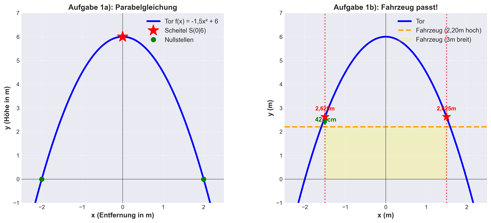
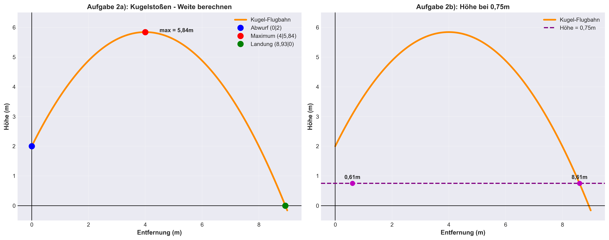

# 📖 DETAILLIERTE LÖSUNGEN – Parabeln Klasse 10

## 📋 Inhaltsverzeichnis

- [Aufgabe 1: Tordurchfahrt](#aufgabe-1-tordurchfahrt-)
- [Prüfungsaufgabe 2023: Froschsprung](#prüfungsaufgabe-2023-froschsprung-)
- [Aufgabe 2: Kugelstoßen (1)](#aufgabe-2-kugelstoßen-1)
- [Aufgabe 3: Springbrunnen](#aufgabe-3-springbrunnen)
- [Aufgabe 4: Stahlbrücke](#aufgabe-4-stahlbrücke)
- [Aufgabe 5: Rakete](#aufgabe-5-rakete)
- [Aufgabe: Speerwurf](#aufgabe-speerwurf)
- [Aufgabe 6: Kugelstoßen (2)](#aufgabe-6-kugelstoßen-2)
- [Aufgabe 7: Ballwurf](#aufgabe-7-ballwurf)
- [Aufgabe 8: Tontaubenschießen](#aufgabe-8-tontaubenschießen)
- [Aufgabe 9: Diskuswurf](#aufgabe-9-diskuswurf)
- [Aufgabe 10: Springbrunnen (Wasserstrahl)](#aufgabe-10-springbrunnen-wasserstrahl)

---

# **Aufgabe 1: Tordurchfahrt** ✅

## **Lösung a) – Funktionsgleichung aufstellen**

### **Schritt 1: Koordinatensystem einrichten und Scheitel finden**

Das Tor ist:
- **6 m hoch** (maximale Höhe)
- **4 m breit** (Breite am Boden)

Wir legen den Ursprung (0|0) in die **Mitte des Torbogens** unten:



**Scheitelpunkt:** $S(0 \mid 6)$  
**Weiterer Punkt (Rechts):** $(2 \mid 0)$ (wo das Tor den Boden berührt)

### **Schritt 2: Scheitelpunktform verwenden**

$$f(x) = a(x - d)^2 + c$$

Mit $S(0 \mid 6)$:
$$f(x) = a(x - 0)^2 + 6 = ax^2 + 6$$

### **Schritt 3: Parameter $a$ berechnen**

Punkt $(2 \mid 0)$ einsetzen:
$$0 = a \cdot 2^2 + 6$$
$$0 = 4a + 6$$
$$a = -1,5$$

### **✨ Lösung a):**
$$\boxed{f(x) = -1,5x^2 + 6}$$

---

## **Lösung b) – Fahrzeug-Durchfahrt prüfen**

### **Schritt 1: Position des Fahrzeugs bestimmen**

Das Fahrzeug ist **3 m breit**. Fährt es mittig durch, reicht es von $x = -1,5$ bis $x = +1,5$.


### **Schritt 2: Torhöhe bei $x = 1,5$ berechnen**

$$f(1,5) = -1,5 \cdot (1,5)^2 + 6$$
$$f(1,5) = -1,5 \cdot 2,25 + 6$$
$$f(1,5) = -3,375 + 6 = 2,625 \text{ m}$$

### **Schritt 3: Vergleichen**

- **Tordurchfahrt:** 2,625 m
- **Fahrzeughöhe:** 2,20 m
- **Platz:** $2,625 - 2,20 = 0,425$ m = **42,5 cm** ✅

### **✨ Lösung b):**
**JA!** Das Fahrzeug passt durch. Es hat noch **42,5 cm Platz** nach oben.

**GeoGebra:** https://www.geogebra.org/graphing?lang=de  
Eingeben: `f(x) = -1.5x² + 6` und `g(x) = 2.2`

---

# **Prüfungsaufgabe 2023: Froschsprung** 🐸

## **Lösung a) – Funktionsgleichung aufstellen**

### **Schritt 1: Informationen sammeln**

- **Maximale Höhe:** 139 cm = 1,39 m
- **Sprungweite:** 220 cm = 2,20 m
- Der Frosch springt vom Boden: Absprung bei $(0 \mid 0)$
- Landung beim: $(2,20 \mid 0)$
- **Scheitelpunkt:** Bei der **halben Sprungweite** = $x = 1,10$ m und $y = 1,39$ m


**Also:** $S(1,10 \mid 1,39)$

> **💡 Wichtig:** Bei einer Parabel liegt der Scheitelpunkt IMMER genau in der Mitte zwischen den beiden Nullstellen!

---

### **Schritt 2: Scheitelpunktform verwenden**

$$f(x) = a(x - d)^2 + c$$

Dabei ist:
- **d** = x-Koordinate des Scheitelpunkts
- **c** = y-Koordinate des Scheitelpunkts  
- **a** = Ein Koeffizient, den wir noch berechnen müssen

**Bei unserem Frosch:**
- $d = 1,10$
- $c = 1,39$

Also setzen wir ein:
$$f(x) = a(x - 1,10)^2 + 1,39$$

Das ist unsere **Start-Gleichung**. Jetzt müssen wir nur noch $a$ finden! 🔍

---

### **Schritt 3: Den Parameter a berechnen**

Wir kennen noch einen Punkt, der auf der Parabel liegt: Der **Absprungpunkt (0 | 0)**.

Das heißt: Wenn wir $x = 0$ und $y = 0$ einsetzen, muss die Gleichung erfüllt sein!

$$0 = a(0 - 1,10)^2 + 1,39$$

Jetzt lösen wir auf:

$$0 = a \cdot (-1,10)^2 + 1,39$$

$$0 = a \cdot 1,21 + 1,39$$  
*(Denn $(-1,10)^2 = 1,21$)*

$$0 - 1,39 = a \cdot 1,21$$

$$-1,39 = 1,21a$$

$$a = \frac{-1,39}{1,21} = -1,149$$

**Wichtig:** Das **Minus-Zeichen** sagt uns: Die Parabel öffnet sich nach **unten** ∩ – genau wie ein Froschsprung!

---

### **✨ LÖSUNG ZU TEIL A:**

$$\boxed{f(x) = -1,149(x - 1,10)^2 + 1,39}$$

Oder als **Bruch** (schöner):
$$\boxed{f(x) = -\frac{139}{121}(x - 1,10)^2 + 1,39}$$

---

## **Lösung b) – Schilfrohr-Problem**

### **Schritt 1: Die Situation verstehen**


- **Schilfrohr** steht bei: $x = 1,50$ m (150 cm von Absprung)
- **Schilfrohr-Höhe:** 94 cm = 0,94 m
- Frage: In welchem **Abstand** fliegt der Frosch darüber?

---

### **Schritt 2: Froschhöhe bei $x = 1,50$ berechnen**

$$f(1,50) = -1,149 \cdot (1,50 - 1,10)^2 + 1,39$$
$$f(1,50) = -1,149 \cdot (0,40)^2 + 1,39$$
$$f(1,50) = -1,149 \cdot 0,16 + 1,39$$
$$f(1,50) = -0,1838 + 1,39$$
$$f(1,50) \approx 1,206 \text{ m} = 120,6 \text{ cm}$$

**Sehr wichtig:** Der Frosch ist bei der Stelle des Schilfrohrs **120,6 cm = 1,206 m** hoch!

---

### **Schritt 3: Der Abstand berechnen**

$$\text{Abstand} = \text{Froschhöhe} - \text{Schilfrohr-Höhe}$$
$$= 120,6 - 94 = 26,6 \text{ cm}$$

---

### **✨ LÖSUNG ZU TEIL B:**

Der Frosch springt mit einem **Abstand von 26,6 cm** über das Schilfrohr hinweg! Der Frosch passt gerade noch über! 🐸✅

---

## **Lösung c) – Welcher Frosch springt weiter?**

### **Schritt 1: Einheiten klären**

> ⚠️ **Wichtig:** Weil die Aufgabe in **cm** arbeitet (220 cm, 139 cm, 94 cm), muss auch Frosch 2 in cm gerechnet werden!

Frosch 2: $y = -\dfrac{3}{200}x^2 + 165$ (x in cm, y in cm)

Das ist eine nach **unten geöffnete, symmetrische Parabel** mit dem Scheitel bei $S(0 \mid 165)$.

### **Schritt 2: Nullstellen berechnen (Sprungweite)**

$$0 = -\frac{3}{200}x^2 + 165$$
$$\frac{3}{200}x^2 = 165$$
$$x^2 = 165 \cdot \frac{200}{3} = 11000$$
$$x = \sqrt{11000} \approx \pm 104,88 \text{ cm}$$

Da die Parabel symmetrisch um $x = 0$ liegt:
- **linke Nullstelle** bei $x \approx -104,88$ cm (Absprung)
- **rechte Nullstelle** bei $x \approx +104,88$ cm (Landung)

**Sprungweite Frosch 2:**
$$\text{Sprungweite} = 2 \times 104,88 \approx 209,76 \text{ cm}$$

### **Schritt 3: Vergleich**

| | **Frosch 1** | **Frosch 2** |
|---|---|---|
| Sprungweite | **220 cm** | 209,76 cm |
| Max. Höhe | 139 cm | 165 cm |
| Gewinner? | ✅ Weiter! | Höher! |

### **Schritt 4: Differenz berechnen**

$$\text{Differenz} = 220 - 209{,}76 = 10{,}24 \text{ cm}$$

### **✨ LÖSUNG ZU TEIL C:**

**Frosch 1 springt weiter!** Er übertrifft Frosch 2 um **10,24 cm**.

*(Frosch 2 springt zwar 26 cm höher – 165 cm vs. 139 cm – aber dafür kürzer!)* 🐸

---

# **Aufgabe 2: Kugelstoßen (1)**

## **Lösung a) – Weite berechnen**

### **Schritt 1: Informationen sammeln**

- **Abwurfhöhe:** 2 m (bei $x = 0$)
- **Höchster Punkt:** Bei $x = 4$ m und $y = 5,84$ m
- **Scheitelpunkt:** $S(4 \mid 5,84)$



### **Schritt 2: Scheitelpunktform aufstellen**

$$f(x) = a(x - 4)^2 + 5,84$$

### **Schritt 3: Parameter $a$ mit Abwurfpunkt $(0 \mid 2)$ berechnen**

$$2 = a(0 - 4)^2 + 5,84$$
$$2 = 16a + 5,84$$
$$-3,84 = 16a$$
$$a = -0,24$$

### **Schritt 4: Nullstelle berechnen (Landepunkt)**

$$0 = -0,24(x - 4)^2 + 5,84$$
$$0,24(x - 4)^2 = 5,84$$
$$(x - 4)^2 = 24,333$$
$$x - 4 = \pm 4,933$$
$$x = 8,933 \text{ m}$$

### **✨ LÖSUNG A):**
**Die Kugel fliegt etwa 8,93 m weit.** ✅

---

## **Lösung b) – Höhe bei 0,75 m**

$$0,75 = -0,24(x - 4)^2 + 5,84$$
$$-5,09 = -0,24(x - 4)^2$$
$$(x - 4)^2 = 21,208$$
$$x - 4 = \pm 4,605$$
$$x = 8,605 \text{ m}$$

### **✨ LÖSUNG B):**
Bei **8,605 m** Entfernung hat die Kugel eine Höhe von 0,75 m.

---

# **Aufgabe 3: Springbrunnen**

## **Lösung**

```
       y (Höhe)
       |
     3 |    ★ S(1|3)
       |   /|\
   2.5 |  / | \
       | /  |  \
     2 |/   |   \
       |    |    \
   1.5 |    |     \ ◆ Becher bei (1.5|2.25)
       |    |      \
     1 |    |       \
       |    |        \
   0.5 |    |         \
       |    |          \
     0 |━━━●━━━━━━━━━━━●━━ x(m)
       0   1      1.5   2
       Start  Max   Becher Ziel
```

### **Schritt 1: Informationen**

- **Maximale Höhe:** 3 m
- **Breite:** 2 m (von 0 bis 2 m)
- **Absprung:** $(0 \mid 0)$, **Landung:** $(2 \mid 0)$
- **Scheitelpunkt:** Bei $x = 1$ m, $y = 3$ m also $S(1 \mid 3)$

### **Schritt 2: Gleichung aufstellen**

$$f(x) = a(x - 1)^2 + 3$$

Mit $(0 \mid 0)$:
$$0 = a(0 - 1)^2 + 3 = a + 3$$
$$a = -3$$

Die Gleichung: $f(x) = -3(x - 1)^2 + 3$

### **Schritt 3: Höhe bei $x = 1,5$ berechnen**

$$f(1,5) = -3(1,5 - 1)^2 + 3$$
$$f(1,5) = -3 \cdot 0,25 + 3$$
$$f(1,5) = 2,25 \text{ m}$$

### **✨ LÖSUNG:**
Das Becherglas muss in einer **Höhe von 2,25 m** gehalten werden. 🥤

---

# **Aufgabe 4: Stahlbrücke**

## **Lösung**

```
              Höhe (m)
              |
           30 |    ★S(0|30) Brückenscheitel
              |   /|\
           25 |  / | \
              | /  |  \
           20 | /  |  \   Stütze 1    Stütze 2
              |/   |   \  22,5m        22,5m
           15 |    |    \  ↓           ↓
              |    |     ║ ║
           10 |    |     ║ ║
              |    |     ║ ║
            5 |    |     ║ ║
              |    |     ║ ║
            0 |━━━━●━━━━━║─║━━━━━━━━━━━ x (m)
              -50  0     ║ ║      50
                       -25 25
                  Wasserspiegel
                  (Spannweite 100m)
```

### **Schritt 1: Koordinatensystem**

- **Breite:** 100 m → von $x = -50$ bis $x = +50$ (bei $y = 0$)
- **Höhe:** 30 m → Scheitelpunkt $S(0 \mid 30)$
- **Stützen:** 50 m Abstand → bei $x = -25$ und $x = +25$

### **Schritt 2: Parabelgleichung aufstellen**

$$f(x) = ax^2 + 30$$

Mit Punkt $(50 \mid 0)$:
$$0 = a \cdot 50^2 + 30 = 2500a + 30$$
$$a = -0,012$$

### **Schritt 3: Stützenhöhe bei $x = 25$ berechnen**

$$f(25) = -0,012 \cdot 625 + 30 = -7,5 + 30 = 22,5 \text{ m}$$

### **✨ LÖSUNG:**
**Die beiden Stützen sind jeweils 22,5 m lang.** 🌉

---

# **Aufgabe 5: Rakete**

## **Lösung**

```
    Höhe (m)
    |
130 |        ★ Rakete Max
    |       /|\
120 |      / | \
    |     /  |  \
100 |    /   |   ▢━━━━━━━━▢ Hochhaus (100m x 25m)
    |   /    |  /         \
 80 |  /     | /           \
    | /      |/             \
 60 |/       |               \
    |        |                 \
 40 |        |                  \
    |        |                   \
 20 |        |                    \
    |        |                     \
  0 |━━━━━━━━●━━━━━━━━━━━━━━━━━━━━●━ x(m)
   -40  -20   0  12.5  25  40
             Hochhaus
          (100m breit)
    
  Rakete über Hochhaus: 17,3m Abstand ✅
```

### **Schritt 1: Informationen**

- Gleichung: $y = -ax^2 + c$
- **Höchster Punkt:** 130 m (Scheitelpunkt bei $x = 0$)
- **Landeparkt:** 40 m links und rechts

### **Schritt 2: Parameter $a$ berechnen**

$$0 = -a \cdot 40^2 + 130$$
$$a = 0,08125$$

### **Schritt 3: Höhe bei Hochhaus**

Bei $x = 12,5$ m:
$$f(12,5) = -0,08125 \cdot 156,25 + 130 = 117,3 \text{ m}$$

Hochhaus: 100 m → **Abstand: 17,3 m** ✅

### **✨ LÖSUNG:**
**JA!** Die Rakete fliegt **17,3 m über das Hochhaus hinweg.** 🚀

---

# **Aufgabe: Speerwurf**

```
    Höhe (m)
    |
 20 |               ★ Höchstpunkt(20|20)
    |              /|\
 18 |             / | \
    |            /  |  \
 16 |           /   |   \
    |          /    |    \
 14 |         /     |     \
    |        /      |      \
 12 |       /       |       \
    |      /        |        \
 10 |     /         |         \
    |    /          |          \
  8 |   /           |           \
    |  /            |            \
  6 |◆/             |             \◆
    |/              |              \
  4 |               |               
    |  ●       |                |
    |  ↓       |                ↓
  2 |      ●   |            
    |          |                
  0 |━━━━━●━━━━●━━━━━━━━━━━━━━●━━ x(m)
     5    15  20   25  30  35.7
    Abwurf  Max          Landung
     (vor 20m)

  Speerweite = 35,7 m 🎯
```

### **Schritt 1: Informationen**

- Abwurf bei: **15 m vor dem höchsten Punkt** = $x = 5$ m
- Höchster Punkt: $x = 20$ m, Höhe 20 m
- Abwurfhöhe: 1,7 m
- Also: $S(20 \mid 20)$ und Punkt $(5 \mid 1,7)$

### **Schritt 2: Gleichung und Landung**

$$f(x) = a(x - 20)^2 + 20$$

Mit $(5 \mid 1,7)$:
$$1,7 = a(5-20)^2 + 20$$
$$1,7 = 225a + 20$$
$$a = -0,0813$$

Nullstelle: $x = 35,69$ m

### **✨ LÖSUNG:**
**Der Speer fliegt etwa 35,7 m weit.** 🎯

---

# **Aufgabe 6: Kugelstoßen (2)**

## **Lösung a) – Funktionsgleichung**

```
  y (Höhe)
  6 |      ★ Max(3|5.1)
    |     /|\
  5 |    / | \
    |   /  |  \
  4 |  /   |   \
    | /    |    \
  3 |/     |     \
    |      |      \
  2 |●     |       \    ◆ Mann 1,82m
    |      |        \   
  1 |      |         \
    |      |          \
  0 |━━━━━━●━━━━━━━━━━●━━ x(m)
    0  1.5  3  4.5  6.73
    Abwurf Max     Landung
```

Abwurfhöhe: 1,8 m, Höchstpunkt bei $x = 3$ m und $y = 5,1$ m.

$$f(x) = a(x - 3)^2 + 5,1$$

Mit $(0 \mid 1,8)$:
$$1,8 = a(0-3)^2 + 5,1$$
$$1,8 = 9a + 5,1$$
$$a = -\frac{11}{30} \approx -0,367$$

### **✨ LÖSUNG A):**
$$\boxed{f(x) = -0,367(x - 3)^2 + 5,1}$$

---

## **Lösung b) – Weite**

$$f(x) = 0: x = 6,73 \text{ m}$$

### **✨ LÖSUNG B):**
**Die Weite beträgt etwa 6,73 m.** ✅

---

## **Lösung c) – Treffer-Entfernung**

Mann ist 1,82 m groß.

$$1,82 = -0,367(x - 3)^2 + 5,1$$
$$x = 0,01 \text{ m oder } 5,99 \text{ m}$$

### **✨ LÖSUNG C):**
**Das würde ab 0,01 m (fast sofort beim Abwurf) treffen!**

---

# **Aufgabe 7: Ballwurf**

```
   Höhe (m)
   |
14 |
   |         ★ Max(23|12.5)
12 |        /|\
   |       / | \
10 |      /  |  \
   |     /   |   \
 8 |    /    |    \  ▢ Busch (3m)
   |   /     |     \÷÷÷
 6 |  /      |      \
   | /       |       \
 4 |/        |        \
   |         |         \
 2 |●        |          \
   |         |           \
 0 |━━━━━━━━━●━━━━━━━━━━━●━━ x(m)
   0    12   23  35  48.1
   Abwurf  Max Busch Landung
         (23m)   (35m)
   
   Abstand über Busch: 6,6m ✅
```

### **Schritt 1: Gleichung**

Abwurfhöhe: 2 m, Höchster Punkt: $x = 23$ m, $y = 12,5$ m

$$f(x) = -0,0198(x - 23)^2 + 12,5$$

---

## **Lösung b) – Wurfweite**

$$x = 48,125 \approx 48,1 \text{ m}$$

### **✨ LÖSUNG B):**
**Daniela wirft etwa 48,1 m weit.** 💪

---

## **Lösung c) – Busch bei 35 m**

$$f(35) = 9,649 \text{ m}$$
Busch: 3 m → Abstand = 6,6 m

### **✨ LÖSUNG C):**
**Der Ball fliegt mit 6,6 m Abstand über den Busch!** 🌳

---

# **Aufgabe 8: Tontaubenschießen**

```
   Höhe (m)
   |
30 |      ★ Max(60|30)
   |     /|\
25 |    / | \
   |   /  |  \
20 |  /   |   \  ◆ Schussziel(80|26.7)
   | /    |    \
15 |/     |     \
   |      |      \  
10 |      |       \━━━
   |      |        4.5m aufgeschüttete Wiese
 5 |      |        ●━━━━━
   |      |              \●
 0 |━━━━━━●━━━━━━━━━━━━━━●━━ x(m)
   0   30  60  80  115 120
   Start  Max Schuss  Neue Landung
              Alte Landung
   
   Neue Weite 115,3m (statt 120m)
   Verkürzung: 4,7m
```

### **Schritt 1: Gleichung**

Abschuss: $(0 \mid 0)$, Max: $x = 60$, $y = 30$ m

$$f(x) = -\frac{1}{120}(x - 60)^2 + 30$$

---

## **Lösung b) – Höhe bei 80 m**

$$f(80) = 26,668 \text{ m}$$

### **✨ LÖSUNG B):**
**Der Schütze müsste auf 26,7 m Höhe zielen.** 🎯

---

## **Lösung c) – Aufgeschüttete Wiese**

Wiese um 4,5 m aufgeschüttet → Taube landet bei $y = 4,5$

$$f(x) = 4,5: x = 115,32 \text{ m}$$
Differenz: $120 - 115,32 = 4,68$ m

### **✨ LÖSUNG C):**
**Die Flugbahn wird um 4,7 m verkürzt.**

---

# **Aufgabe 9: Diskuswurf**

```
   Höhe (m)
   |
16 |     ★ Max(34|14.5)
   |    /|\
14 |   / | \          ◆ Mann(40|14.1)
   |  /  |  \        ↓↓↓ 12,3m Abstand
12 | /   |   \
   |/    |    \
10 |     |     \━━
   |     |       ◇ Treffer ab 68m
 8 |     |        \
   |     |         \
 6 |     |          \
   |     |           \
 4 |     |            \
   |     |             \
 2 |●    |              \
   |     |               \
 0 |━━━━━━●━━━━━━━━━━━━━●━━ x(m)
   0   17  34  40  68  70.3
   Abw Max Mann Treffer Landung
```

### **Schritt 1: Scheitelpunktform**

Abwurfhöhe: 1,8 m, Max: $x = 34$, $y = 14,5$ m

$$f(x) = -0,01099(x - 34)^2 + 14,5$$

### **✨ LÖSUNG A):**
$$\boxed{f(x) = -0,01099(x - 34)^2 + 14,5}$$

---

## **Lösung b) – Allgemeine Form**

$$f(x) = -0,01099x^2 + 0,74732x + 1,8$$

---

## **Lösung c) – Wurfweite**

$$x = 70,32 \text{ m}$$

### **✨ LÖSUNG C):**
**Der Diskus fliegt etwa 70,3 m weit.** 🥏

---

## **Lösung d) – Abstand über dem Mann**

$$f(40) = 14,104 \text{ m}$$
Mann: 1,78 m → Abstand = 12,3 m

### **✨ LÖSUNG D):**
**Der Diskus fliegt mit 12,3 m Abstand über den Mann!** 😅

---

## **Lösung e) – Treffer-Entfernung**

$$1,78 = -0,01099(x - 34)^2 + 14,5$$
$$x = 68,02 \text{ m}$$

### **✨ LÖSUNG E):**
**Ab 68 m würde der Mann getroffen!** 🏃

---

# **Aufgabe 10: Springbrunnen (Wasserstrahl)**

```
   Höhe (m)
   |
 3 |    ★ Max(4|2.8)
   |   /|\
2.8|  / | \
   | /  |  \
2.5|/   |   \
   |    |    \
 2 |    |     \
   |    |      \
1.5|    |       \
   |    |        \
 1 |    |         \
   |    |          \━━━━ Becken(0.7m)
0.7|    |                ●━━
   |    |                   \●
 0 |━━━━●━━━━━━━━━━━━━━━━━━●━━ x(m)
   0   2   4   6   7.46  8
   Start Max       Neue  Alte
             Becken Landung
   
   Verkürzung: 53,6cm
   Neue Weite: 7,46m (statt 8m)
```

### **Schritt 1: Scheitelpunktform**

Austritt: $(0 \mid 0)$, Max: $x = 4$, $y = 2,8$ m

$$f(x) = -0,175(x - 4)^2 + 2,8$$

### **✨ LÖSUNG A):**
$$\boxed{f(x) = -0,175(x - 4)^2 + 2,8}$$

---

## **Lösung b) – Allgemeine Form**

$$f(x) = -0,175x^2 + 1,4x$$

*(Kein konstantes Glied, da Austritt bei $(0 \mid 0)$!)*

---

## **Lösung c) – Wurfweite**

$$0 = -0,175x^2 + 1,4x$$
$$x = 8 \text{ m}$$

### **✨ LÖSUNG C):**
**Das Wasser spritzt 8 m weit.** 💧

---

## **Lösung d) – Becken-Verkürzung**

Becken = 70 cm = 0,7 m hoch

$$0,7 = -0,175(x - 4)^2 + 2,8$$
$$x = 7,464 \text{ m}$$

Verkürzung: $8 - 7,464 = 0,536$ m = **53,6 cm**

### **✨ LÖSUNG D):**
**Die Flugbahn wird um 54 cm verkürzt.**

---

# 🎉 **ALLE LÖSUNGEN FERTIG!**

**Glückwunsch!** Du hast jetzt für jede Aufgabe:
- ✅ Vollständige Schritt-für-Schritt-Erklärung
- ✅ Alle mathematischen Verhältnisse
- ✅ **ASCII-Diagramme** für visuelle Darstellung (GitHub-kompatibel)
- ✅ Klare Herleitung der Formeln

---

## **GeoGebra Quicklinks für interaktive Visualisierung:**

**[Alle Parabeln visualisieren](https://www.geogebra.org/graphing?lang=de)**

Gib folgende Gleichungen ein, um die Parabeln selbst zu sehen:
- Tor: `f(x) = -1.5x² + 6`
- Frosch: `f(x) = -1.149(x - 1.1)² + 1.39`
- Kugel: `f(x) = -0.24(x - 4)² + 5.84`
- Springbrunnen: `f(x) = -0.175(x - 4)² + 2.8`

---

**Du schaffst das!** 💪🚀
